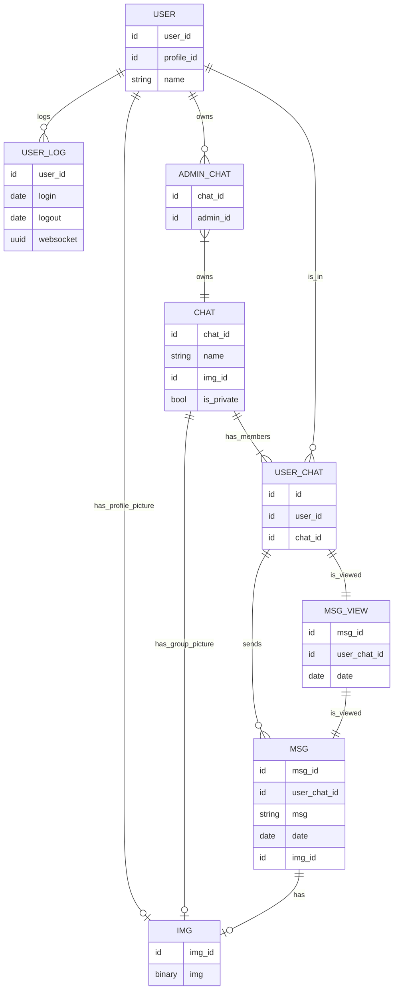

```mermaid
erDiagram
    USER_LOG {
        id user_id
        date login
        date logout
        uuid websocket
    }

    USER ||--o{ USER_LOG : logs

    USER {
        id user_id
        id profile_id
        string name
    }

    USER ||--o| IMG : has_profile_picture

    USER ||--o{ ADMIN_CHAT : owns
    ADMIN_CHAT }|--|| CHAT : owns

    ADMIN_CHAT {
        id chat_id
        id admin_id
    }

    USER_CHAT {
        id id
        id user_id
        id chat_id
    }

    CHAT ||--|{ USER_CHAT : has_members
    USER ||--o{ USER_CHAT : is_in

    CHAT {
        id chat_id
        string name
        id img_id
        bool is_private
    }

    CHAT ||--o| IMG : has_group_picture

    USER_CHAT ||--o{ MSG : sends

    MSG {
        id msg_id
        id user_chat_id
        string msg
        date date
        id img_id
    }

    MSG ||--o| IMG : has

    IMG {
        id img_id
        binary img
    }

    MSG_VIEW {
        id msg_id
        id user_chat_id
        date date
    }

    USER_CHAT ||--|| MSG_VIEW : is_viewed
    MSG_VIEW ||--|| MSG : is_viewed

```